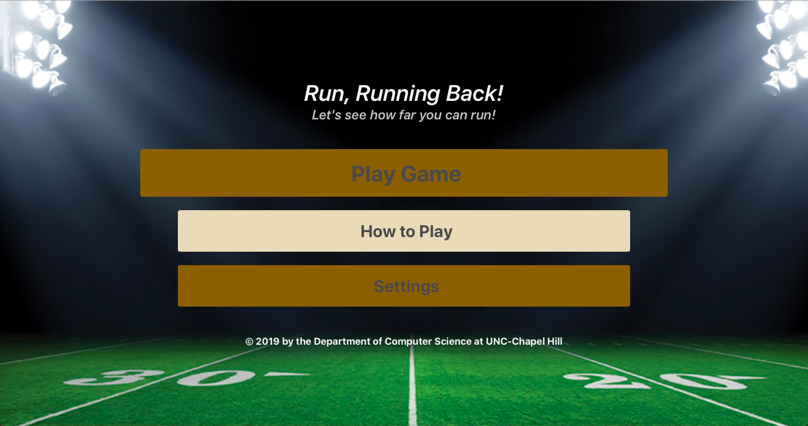
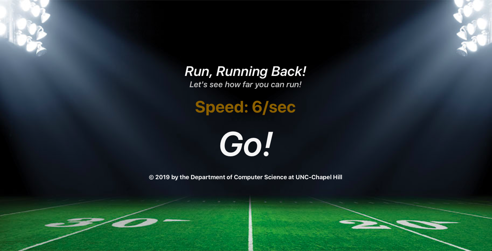
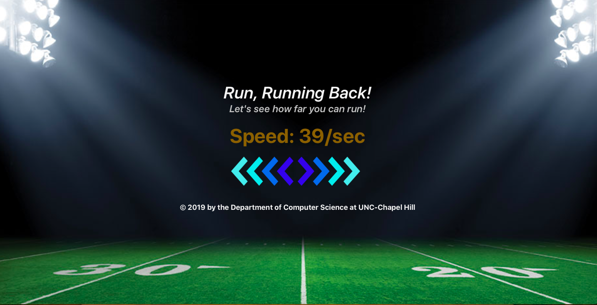
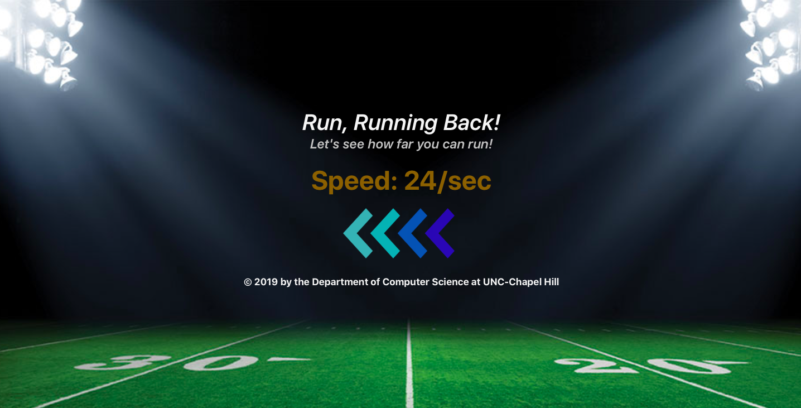
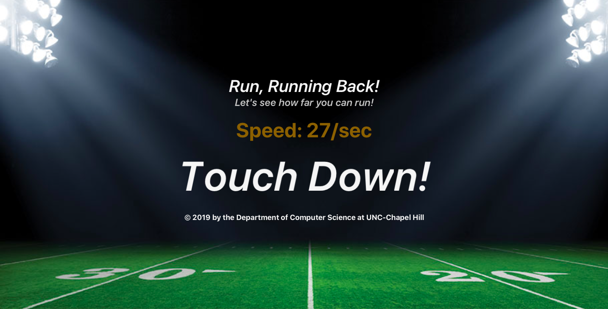

# Run, Running Back!
  * In this game, you are becomming a runningback of a football game. Your mission is to run as fast as you can and get to the end zone.

## Introduction
  * Run, Runningback is an audio web game designed and developed for the K-12 students in North Carolina. The goal of this game is provide a fun gaming experience to them, including even those with visual impairments. The game is going be used for Maze Day, an annual event hosted by the Computer Science department of UNC-Chapl Hill.

## Screenshots

</img>
</img>
</img>
</img>
</img>
</img>

## How to navigate
  * Press the up or down arrow key to navigate the menu bars.
  * Press the space bar to hear on which menu bar you are at now.
  * Press the space bar twice to move to the corresponding page or execute the corresponding event.
  * On the play page, press the space bar to start the game. Press the space bar twice if you want to go back to the main page.

## How to play
  * On the play page, press the space bar to start the game.
  * Once the game starts, you will get passed the ball and you immediately have to run by tapping the left and right arrow keys.
  * If you do not run fast enough, you will be caught and get tackled.
  * In the middle of the game, there would be opponents chasing you from either the left or right side. To dodege them, press the arrow key of the opposite direction from where the opponent is coming. If you succeed in dodging the opponents, press the left and right arrow keys again to continue running.
  * If you are close to the end zone, the announcers will start speaking so that you can know whether you are getting close to the end zone.

## Technologies used
  * Language: HTML, CSS, and JavaScript
  * CSS Framework: Bulma
  * JavaScript Library: jQuery, howler.js, textillate.js, and letterings.js

## Links
  * Game published at - https://chansun.github.io/running-back/
  * More information about Maze Day - https://cs.unc.edu/outreach/maze-day/